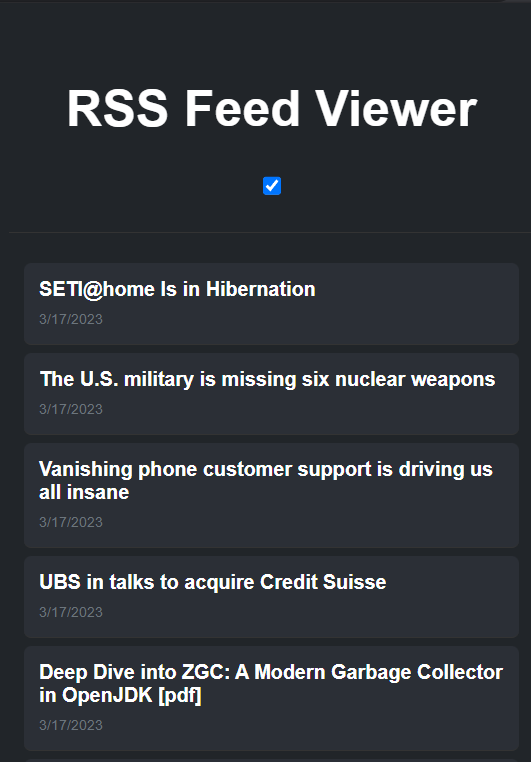

# RSS Feed Viewer (Written by GPT-4)

A lightweight browser extension that displays RSS feeds when clicked. The extension offers a minimalist design with a dark mode toggle, which follows the user's system color scheme preference.

**This extension, as well as this README, is written entirely by GPT-4 (except this line).**

## Features

- Fetch and display RSS feeds in a clean, minimalist design
- Dark mode toggle based on system color scheme preference
- Easy-to-read feed titles

## Installation

1. Download or clone this repository
2. Open your browser's extension management page:
   - For Chrome: Go to `chrome://extensions`
   - For Firefox: Go to `about:addons`
3. Enable "Developer mode" (for Chrome)
4. Click on "Load unpacked extension" (for Chrome)
5. Select the folder containing the extension's files
6. The RSS Feed Viewer extension should now be installed and ready to use!

## Usage

1. Edit your feed in `popup.js`, change your desired feed in `rssFeedUrl`. The default RSS feed is [Hacker News](https://news.ycombinator.com/) frontpage.
2. Click on the extension icon in your browser's toolbar to open the popup
3. The extension will fetch and display the RSS feed items
4. Click on a feed item to open the related article in a new tab
5. Toggle dark mode on or off by clicking on the switch in the header

## License

This project is released under the MIT License.
